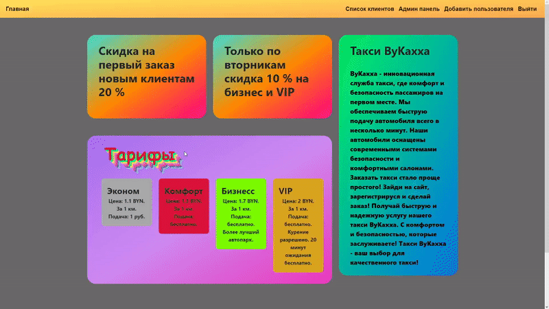
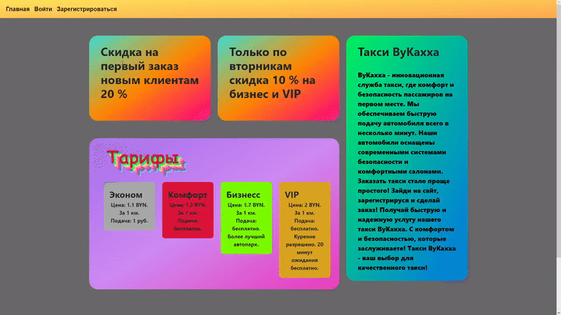
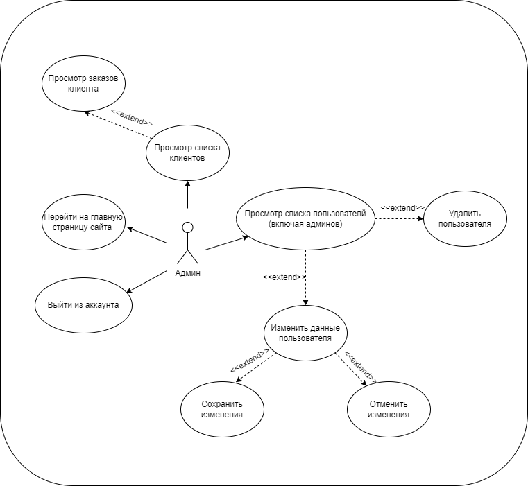
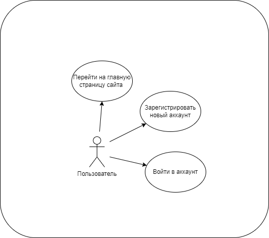
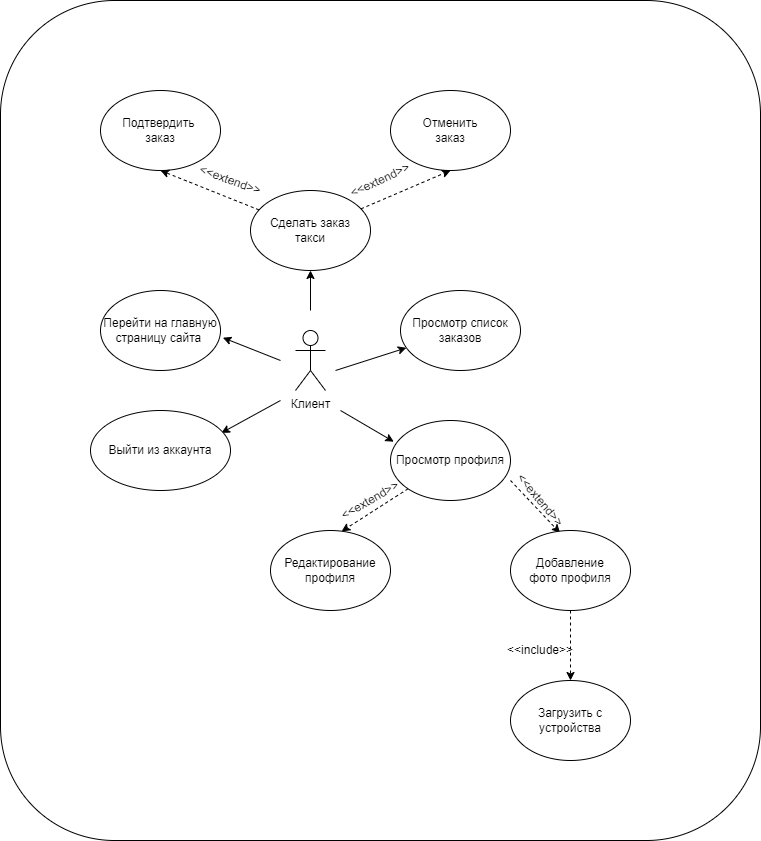
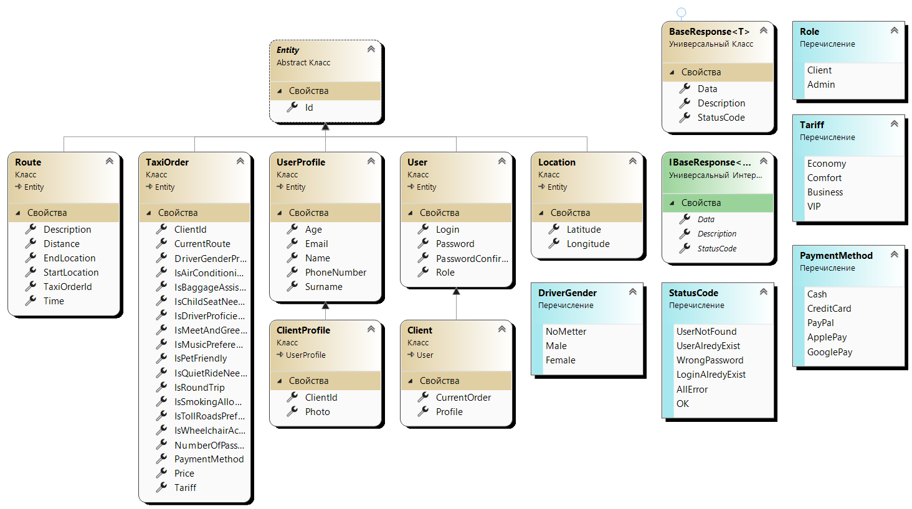
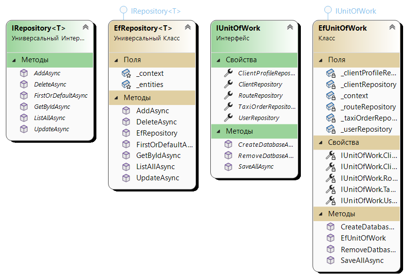
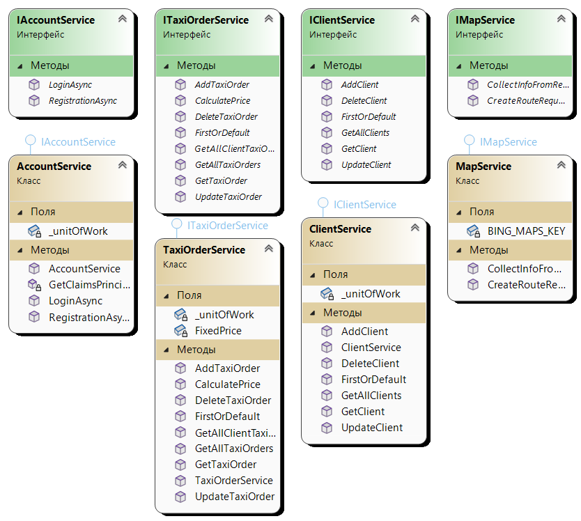
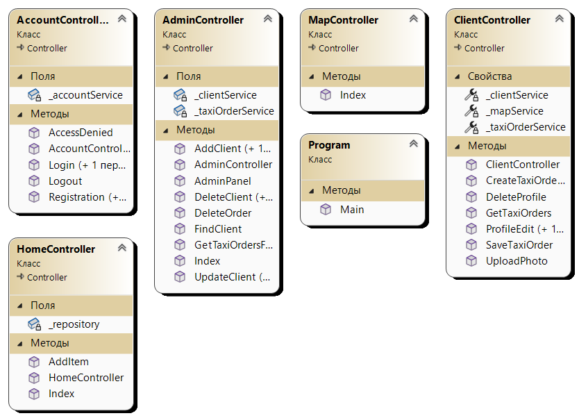

# Taxi Aggregator

Taxi Aggregator - is an online platform or mobile application that connects passengers looking for a taxi with taxi drivers offering their services. It provides a convenient way to order a taxi, allowing passengers to easily choose from various available drivers and fares.

__The development was carried out using ASP.NET Core MVC.__

This project is a course work on the discipline "Object-oriented programming" completed during the 4th semester (February - May 2023).

## Content

- [Description](#description)
- [Application Interface](#application-interface)
  - [Admin](#admin-interface)
  - [User](#user-interface)
  - [Client](#client-interface)
- [Use Case Diagrams](#use-case-diagrams)
  - [Admin](#admin-use-case-diagram)
  - [User](#user-use-case-diagram)
  - [Client](#client-use-case-diagram)
- [UML Diagrams](#uml-diagrams)
  - [Domain](#domain-diagram)
  - [DAL](#dal-diagram)
  - [BLL](#bll-diagram)
  - [WEB](#web-diagram)
- [Installation](#installation)
- [Usage](#usage)
- [Author](#author)
- [License](#license)

## Description

Taxi aggregator is a web platform that allows you to order a taxi based on your preferences and wishes.

__The application provides the following features:__
- User registration and authentication.
- Ordering a taxi fot users.
- View previously completed orders.
- View and edit your profile.
- View full information about user actions for the administrator.
- The right to view/delete/add users and their orders for the administrator.

>__Adding functionality for drivers will be later. Stay tuned!__

# Application Interface

## Admin Interface

## User Interface

## Client Interface

# Use Case Diagrams

## Admin UseCase

## User UseCase

## Client UseCase

# UML Diagrams

## Domain UML

## DAL UML

## BLL UML

## WEB UML

## Installation

1. Clone the repository to your local machine.
2. Open the project in your development environment.
3. Install the required dependencies using __LibMan__.

## Usage

1. Build the project and run it on a local server.
2. Open a web browser and go to your localhost. 
    For example: [http://localhost:8000](http://localhost:8000).

## Author

Project author: [Eugene_Kakhnouski](https://github.com/Kaxxa27).

## License

This project is licensed under the MIT License - see the [LICENSE](LICENSE) file for details.
